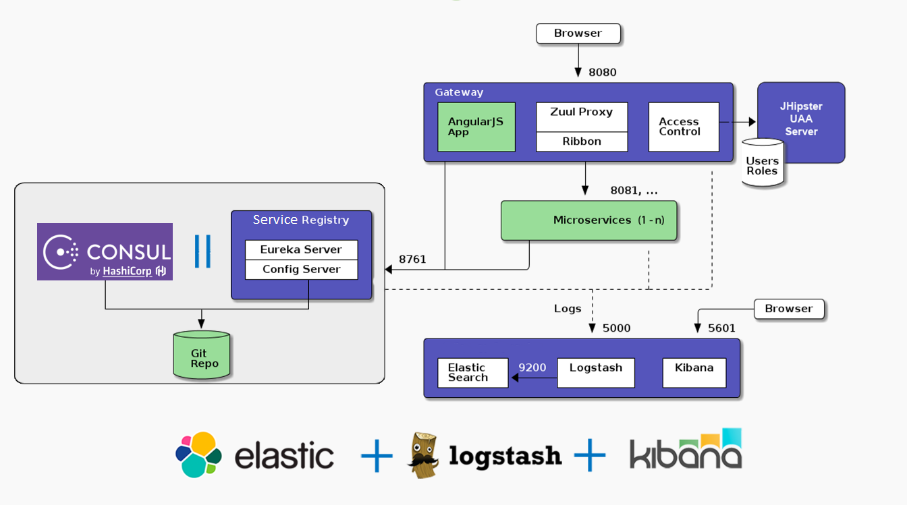

# microservices
### What are microservices?
Microservices - also known as the microservice architecture - is an architectural style that structures an application as a collection of services that are

1. Highly maintainable and testable
2. Loosely coupled
3. Independently deployable
4. Organized around business capabilities
5. Owned by a small team

The microservice architecture enables the rapid, frequent and reliable delivery of large, complex applications. It also enables an organization to evolve its technology stack.

 

## Technology
1. [Eureka server](https://cloud.spring.io/spring-cloud-netflix/spring-cloud-netflix.html) - It is used to provides as a discovery server for applications. This server maintains and distributes a dynamic list of available application instances that are then used by the microservices to do HTTP requests routing and load balancing.
2. [Swagger](https://swagger.io/) - It allows you to describe the structure of your APIs so that machines can read them. The ability of APIs to describe their own structure is the root of all awesomeness in Swagger.
3. [Spring Cloud Config server](https://cloud.spring.io/spring-cloud-config/spring-cloud-config.html) - It is used to provide runtime configuration properties to all applications.
4. [Spring Cloud Openfeign](https://cloud.spring.io/spring-cloud-openfeign/reference/html/) - It is a declarative web service client. It makes writing web service clients easier. To use Feign create an interface and annotate it. Spring Cloud integrates Eureka, as well as Spring Cloud LoadBalancer to provide a load-balanced http client when using Feign. It provides client side load balencer in round robbin fassion.

## Local setup
1. git clone <repo url>
2. Start/deploy all applications in below sequence.
   1. config-server -> ``` java -jar <path to jar file>```
   2. eureka-discovery-server -> ``` java -jar <path to jar file>```
   3. user-service -> ``` java -jar <path to jar file> --spring.profiles.active=dev```
   4. arithmatic-operations-service -> ``` java -jar <path to jar file> --spring.profiles.active=dev```
3. Swagger -> http://localhost:8080/swagger-ui.html
4. Eureka server -> http://localhost:8761/
5. Config server -> http://localhost:8888/user-service/dev or http://localhost:8888/arithmatic-operations-service/dev
6. To test Feign service 
   Open 2 command prompts and run below command on each 
   
   ``` 
   cd arithmatic-operations-service 
   mvn package 
   java -jar target\arithmatic-operations-service-0.0.1-SNAPSHOT.jar --server.port=8083
   Note - use unique port number for each cmd/instance
   ```
   Then hit the url from postman using below details <br />
   ```
   POST: http://localhost:8080/hello
   BODY: { 
          "name" : "prashant"
        }
   ```
   You will see the logs getting printed on both console in round robin fassion.
   
   
## Reference: 
   https://microservices.io/
   https://cloud.spring.io/spring-cloud-openfeign/reference/html/
   https://cloud.spring.io/spring-cloud-config/spring-cloud-config.html
   https://cloud.spring.io/spring-cloud-netflix/multi/multi_pr01.html
   https://cloud.spring.io/spring-cloud-netflix/reference/html/
   
